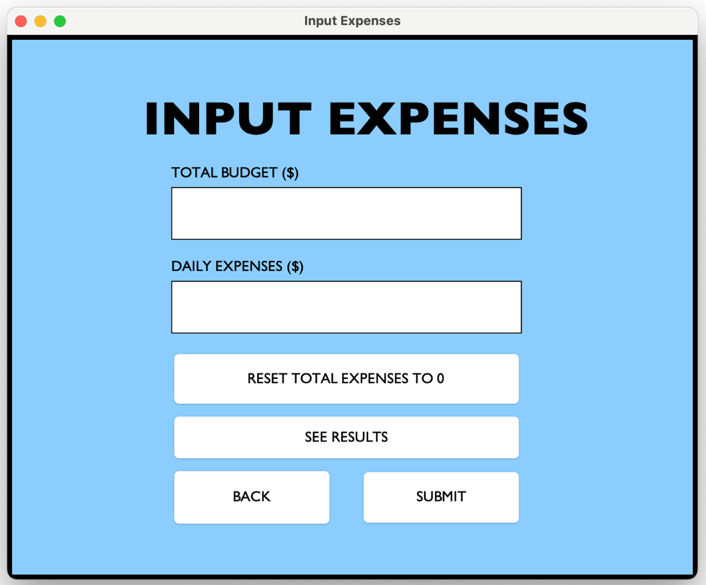
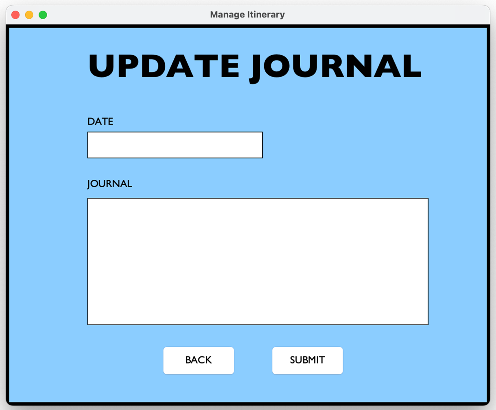
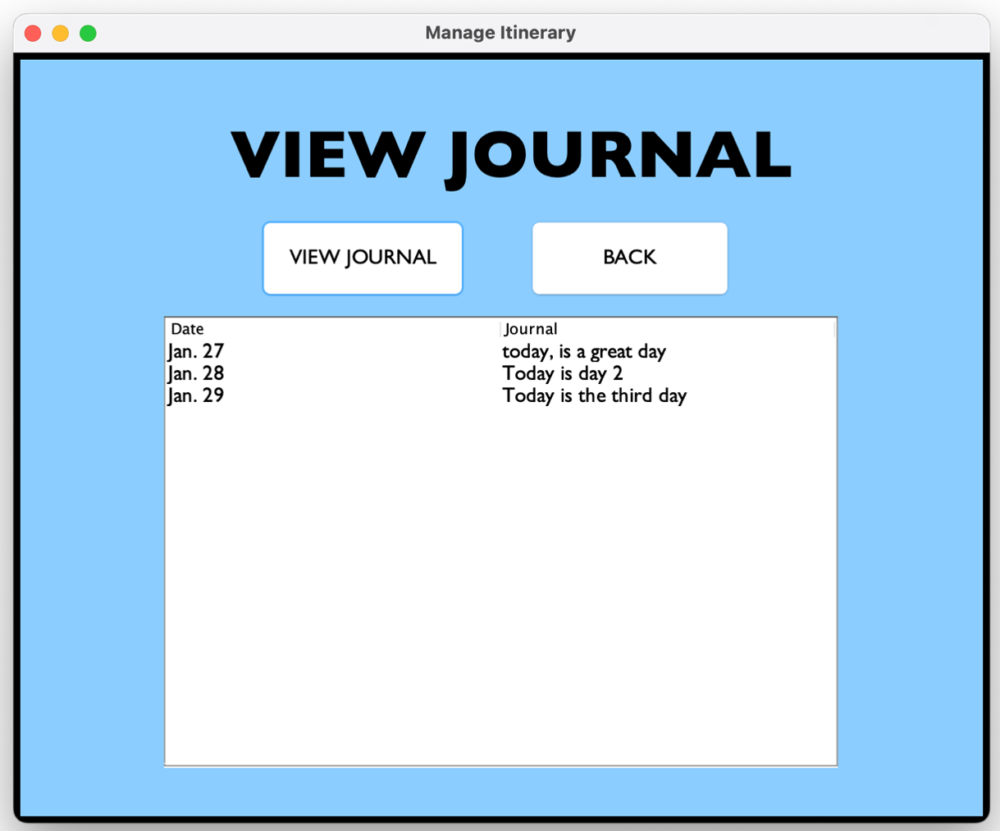

# Travel Management System

A travel management system I created as my Internal Assessment (IA) for [higher level (HL) Computer Science in the International Baccalaureate (IB) Diploma Programme (DP)](https://www.ibo.org/programmes/diploma-programme/curriculum/sciences/computer-science/).

  |   | [Sign in page screenshot](./screenshots/sign_in_ss.png)  |  
:----------------------------------------------------------------:|:----------------------------------------------------------------:|:----------------------------------------------------------------:|:----------------------------------------------------------------:|
  |   |   |  